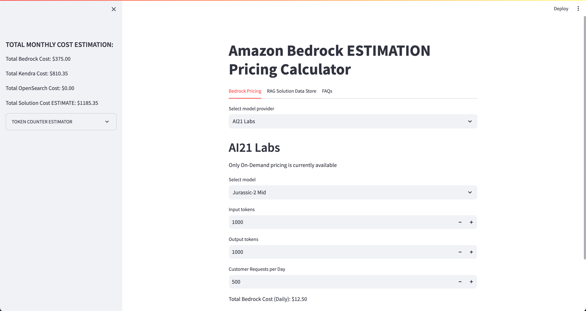

# Amazon-Bedrock-Gen-AI-Pricing-Bot
This is sample code that can be used to provide high-level pricing estimates for Amazon Bedrock Gen AI based applications. The application is constructed with a simple streamlit frontend where users can calculate a pricing estimate for their Gen AI based application that leverages Amazon Bedrock and has support for RAG based architectures.


# **Goal of this Repo:**
The goal of this repo is to provide users the ability to create high level pricing estiamtes for Amazon Bedrock usage  and RAG applications.
This repo comes with a basic frontend to help users stand up the pricing application in just a few minutes.



# How to use this Repo:

## Prerequisites:

1. Ensure Python 3.9 installed on your machine, it is the most stable version of Python for the packages we will be using, it can be downloaded [here](https://www.python.org/downloads/release/python-3911/).

## Step 1:
The first step of utilizing this repo is performing a git clone of the repository.

```
git clone https://github.com/aws-rdoty/Amazon-Bedrock-Gen-AI-Pricing-Bot.git
```

After cloning the repo onto your local machine, open it up in your favorite code editor.

## Step 2:
Set up a python virtual environment in the root directory of the repository and ensure that you are using Python 3.9. This can be done by running the following commands:
```
pip install virtualenv
python3.9 -m venv venv
```
The virtual environment will be extremely useful when you begin installing the requirements. If you need more clarification on the creation of the virtual environment please refer to this [blog](https://www.freecodecamp.org/news/how-to-setup-virtual-environments-in-python/).
After the virtual environment is created, ensure that it is activated, following the activation steps of the virtual environment tool you are using. Likely:
```
cd venv
cd bin
source activate
cd ../../ 
```
After your virtual environment has been created and activated, you can install all the requirements found in the requirements.txt file by running this command in the root of this repos directory in your terminal:
```
pip install -r requirements.txt
```

## Step 3:
As soon as you have successfully cloned the repo, created a virtual environment, activated it, installed the requirements.txt, your Amazon Bedrock Pricing Estimator application should be ready to go. 
To start up the application with its basic frontend you simply need to run the following command in your terminal while in the root of the repositories' directory:

```
streamlit run app.py
```
As soon as the application is up and running in your browser of choice you can begin creating a pricing estimate for your Amazon Bedrock usage and RAG based architecture.

## ***The contents of this repository represent my viewpoints and not of my past or current employers, including Amazon Web Services (AWS). All third-party libraries, modules, plugins, and SDKs are the property of their respective owners.***